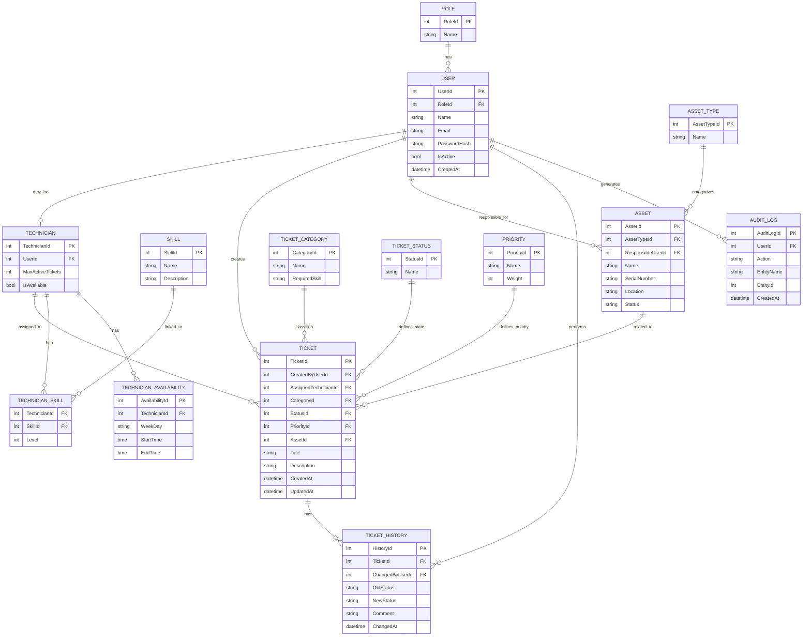

# Diagrama Entidade-Relacionamento

O seguinte diagrama representa a proposta inicial de modelo de dados para o sistema ITSM.

## Justificacao do modelo
O modelo separa utilizadores, perfis, tecnicos, competencias, ativos e tickets. A tabela TechnicianSkill resolve a relacao muitos-para-muitos entre tecnicos e competencias. A tabela TechnicianAvailability permite considerar disponibilidade horaria no algoritmo de atribuicao. O historico de tickets e a auditoria permitem rastrear alteracoes importantes no sistema.
