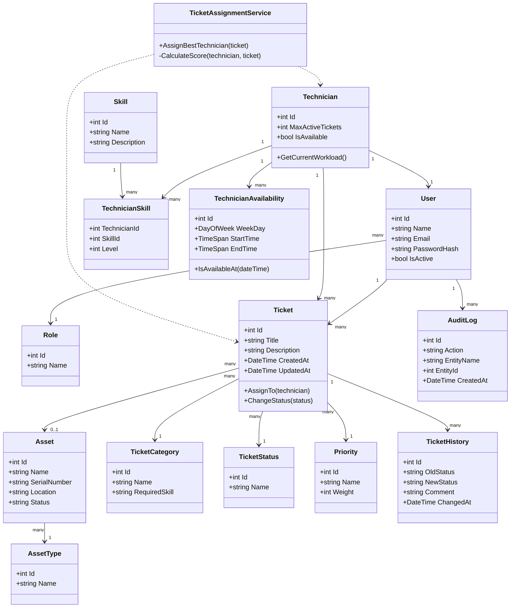

# Diagrama de Classes da Logica de Dominio

O seguinte diagrama representa as classes principais da logica de dominio do sistema.

## Justificacao do dominio
As classes representam os principais conceitos do sistema: utilizadores, tecnicos, competencias, ativos e tickets. A classe TicketAssignmentService representa o servico responsavel pela regra de negocio principal: escolher o tecnico mais adequado para um ticket.
